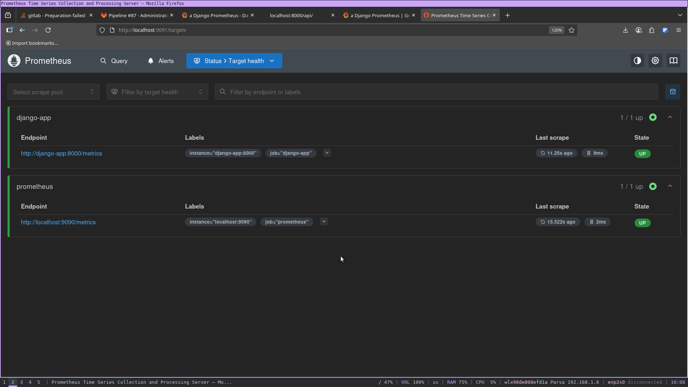
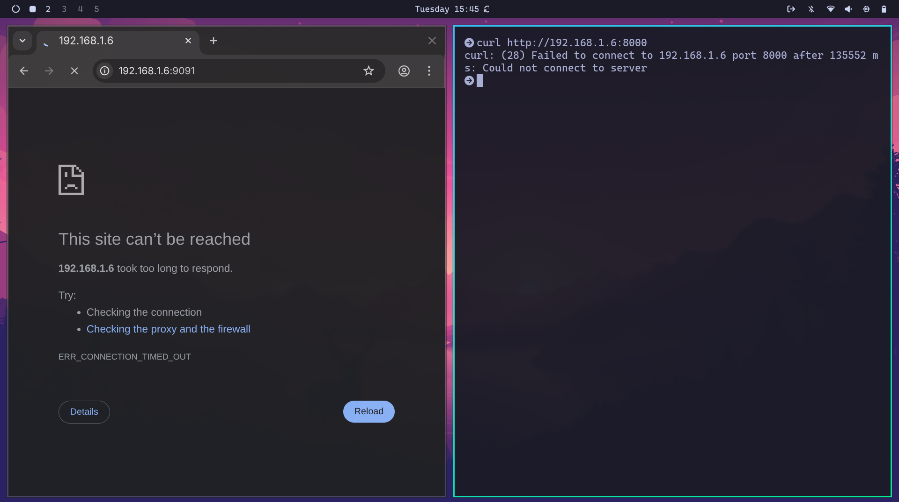
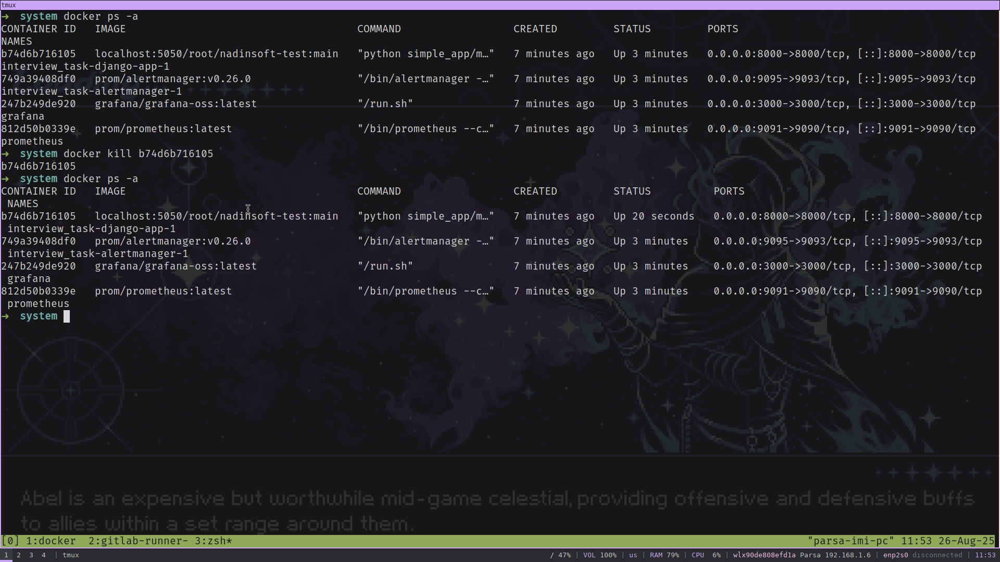

# NadinSoft DevOps Pre-Interview Task

## Overview
This repository contains a containerized Python web service with complete CI/CD pipeline, monitoring, and networking configurations as part of a DevOps practical assessment.

This README include screenshots of:
 ✅ Successful `docker compose up` output
 ✅ Passing GitLab CI pipeline stages, including logs
 ✅ Prometheus targets
 ✅ Grafana dashboard with data
 ✅ Triggered alert in Prometheus ( using Alertmanager )
 ✅ iptables rules verification
 ✅ Container restart after kill

## Architecture
- **Application**: Simple Python web service (django)
- **Containerization**: Docker & Docker Compose
- **CI/CD**: GitLab CI/CD pipeline
- **Monitoring**: Prometheus & Alertmanager
- **Visualization**: Grafana dashboards
- **High Availability**: Container restart policies


## Prerequisites
- Docker (version 20.10+)
- Docker Compose (version 2.0+)
- Git
- GitLab server


## Setup Instructions

### 1. Clone the Repository
```bash
git clone <repository-url>
cd nadinsoft-devops
```


### 3. Local Development Setup
```bash
# Build and start all services
docker compose up -d

# Verify services are running
docker compose ps

```

### 4. Access Services
(NOTE : I've used 9091 and 9095 ports for Prometheus and Grafana , because the traiditional ports (9090 and 9093) were used by gitlab internal service)

- **Web Application**: http://localhost:8000
- **Prometheus**: http://localhost:9091
- **Grafana**: http://localhost:3000
- **Alertmanager**: http://localhost:9095


## CI/CD Pipeline

### Pipeline overview


### Pipeline Stages
1. **Build**: Create Docker images
 

 
5. **Test**: Run unit tests


4. **Push**: Push to container registry


7. **Deploy**: Deploy to production


### Triggering the Pipeline

#### Automatic Triggers
- **Push to main**: Full pipeline (build → test → push and deploy to production)
- **Push to develop**: Build and test only
- **Merge requests**: Build, test, push , deploy


## Monitoring & Alerting

### Prometheus Target Status
- **Application status**: state of django application




### Grafana Dashboards
- **Application Overview**: Request metrics and performance


### Alert Rules
- High response time (95% of requests are taking more than 0.5 seconds)


- Service unavailable (The Django app has been unreachable for 10+ seconds)


## Security & Networking

### iptables Configuration
```bash
# Apply iptable rules
sudo ./setup-iptables.sh

# Verify rules
sudo iptables -L -n -v

# Test external access restriction
curl -m 5 http://external-ip:8080  # Should timeout/fail
```
services are accesible from host


but restrict from outside



### Firewall Rules Applied
- Allow localhost access (127.0.0.1)
- Allow internal Docker network
- Block external access to services
- Allow SSH (port 22) for administration

## Restart Policy
I've implemented a systemd service which restart containers in exit or crash scenarios. 
 (`restart : always` property in docker compose does not restart container after kill)

```ini
[Unit]
Description=Container Restart Service for Nadinsoft test
Requires=docker.service
After=docker.service

[Service]
Type=simple
Restart=always
RestartSec=10
WorkingDirectory=/home/parsa/nadinsoft/Interview_task
ExecStart=/bin/bash -c 'while true; do docker compose ps -aq | xargs docker inspect --format="{{.State.Status}}" | grep -q "exited" && docker compose up -d; sleep 30; done'
ExecStop=/usr/bin/docker compose down

[Install]
WantedBy=multi-user.target
```



## Author
ParsaImani

